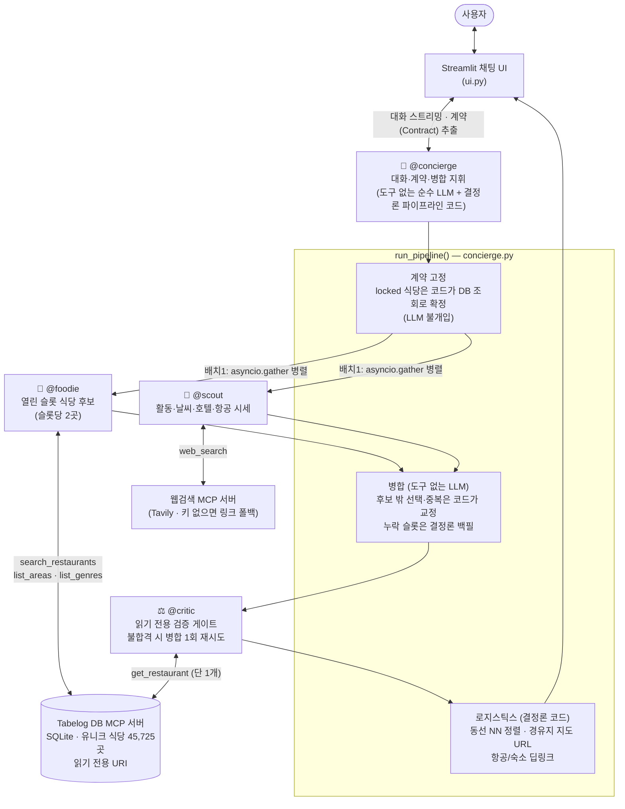
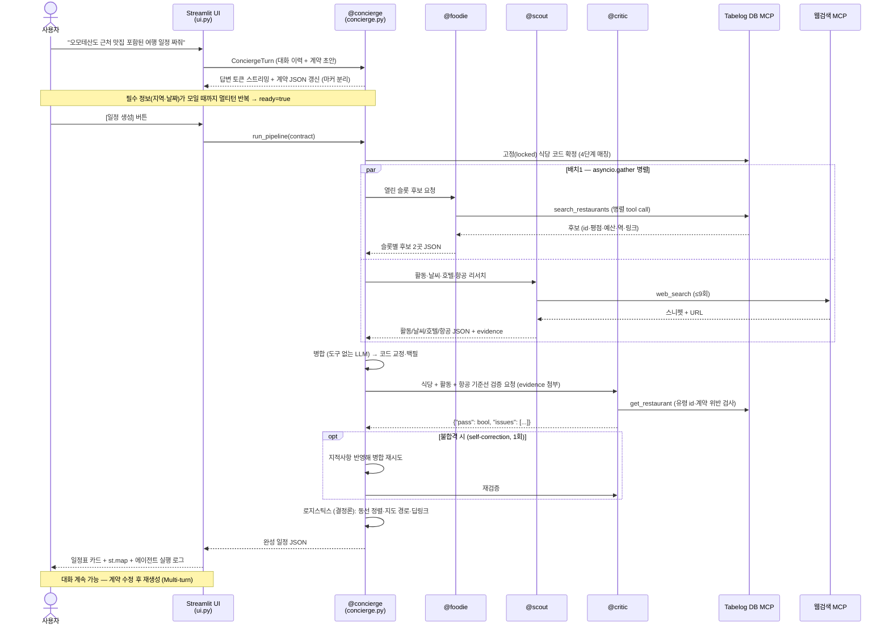
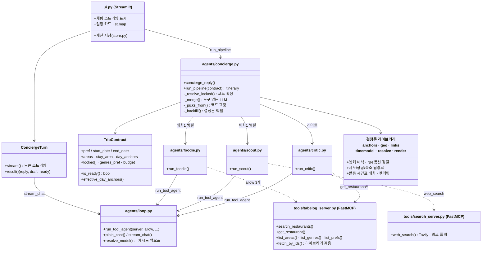

# TabeTabi — 아키텍처

> 이 문서의 다이어그램은 **실제 코드 기준**으로 작성되었다 (GitHub에서 mermaid가 바로 렌더링된다).
> 핵심 설계 원칙: **판단은 LLM이, 계산·검증·확정은 코드가** 한다.

## 1. 컴포넌트 다이어그램

**도구 허용 목록 = 권한 경계**

| 에이전트 | 구현 | 허용 도구 | 이유 |
|---|---|---|---|
| @concierge | `agents/concierge.py` | 없음 (순수 LLM) | 판단만 한다 — 계획 단계에 tools를 주면 실행해버린다 |
| @foodie | `agents/foodie.py` | `search_restaurants` `list_areas` `list_genres` | DB 결과 밖 식당을 "말할 수 없다" → 환각 구조 차단 |
| @scout | `agents/scout.py` | `web_search` | DB 접근 불가 — 식당 추천에 관여 불가 |
| @critic | `agents/critic.py` | `get_restaurant` 1개 | 읽기 전용 — 수정 능력 자체가 없다 |

## 2. 시퀀스 다이어그램

## 3. 모듈 다이어그램

> 에이전트는 클래스 상속 계층이 아니라 **공용 도구 루프(`run_tool_agent`)를 공유하는 함수들**이다.
> 상태를 가진 클래스는 `TripContract`(계약)와 `ConciergeTurn`(스트리밍 1턴) 둘뿐.

## 환각 3중 방어

1. **권한 경계** — @foodie는 DB 도구 결과에서만 후보를 뽑는다.
2. **코드 재조인** — 화면의 이름·평점·링크는 전부 `restaurant_id`로 DB에서 재조회. LLM이 전사한 텍스트를 신뢰하지 않는다.
3. **@critic 게이트 + 코드 교정** — 유령 id·계약 위반·창작 근거(evidence 대조)를 검증하고, 후보 밖 선택은 코드가 교정, 누락 슬롯은 베이지안 랭킹 상위로 결정론 백필.
