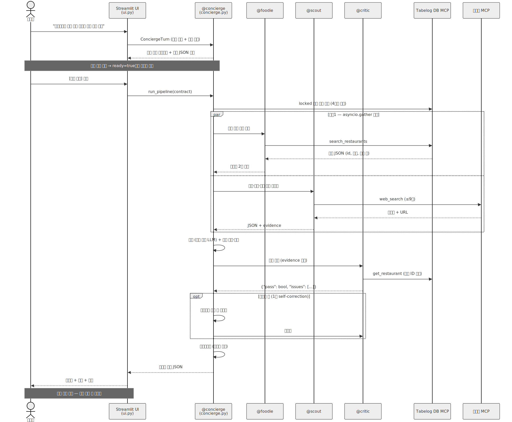

# 🍜 TabeTabi (食べ旅) — 멀티에이전트 미식 여행 컨시어지


-76B900?logo=nvidia&logoColor=white)


> 타베로그(食べログ) 고신뢰 리뷰어 실데이터 **유니크 식당 45,725곳** 위에서, 역할이 분리된 4개의 LLM 에이전트가
> MCP 도구를 들고 협업해 **"맛집 중심 일본 여행 일정"**을 만들어 주는 대화형 서비스입니다.

```
"8월 22일부터 23일까지 도쿄 1박 2일, 성인 2명이야. 라멘·스시·야키니쿠 좋아하고
 저녁 예산은 1인 8,000엔 이하. 1일차 점심은 'らぁ麺や 嶋'로 고정해줘.
 신주쿠 쪽에서 묵을 예정이고 서울에서 출발해!"
```

→ 고정 식당·일정은 **절대 변경하지 않고**, 나머지 슬롯만 추천. 모든 식당은 타베로그 + 구글지도 링크,
하루 동선 경로(경유지 지도 URL), 날짜·구간이 반영된 항공/숙소 검색 딥링크까지 한 번에.

---

## ✨ 핵심 기능

- **대화로 계약(Contract) 완성** — 지역·날짜·예산·취향·고정 식당을 자연어로 말하면 `@concierge`가 SHARED CONTRACT로 추출 (실시간 토큰 스트리밍)
- **병렬 멀티에이전트 리서치 + 부분 결과 우선 표시** — `@scout`(웹검색)은 백그라운드로 돌리고, `@foodie` 식당 라인업이 확정되는 즉시 잠정 표시 → 활동 → 최종 일정 순으로 점진 렌더링 (첫 화면 표시 실측 45초, 완성 86초)
- **항공 시간 반영 (Day Window)** — 도착·귀국편 시각으로 첫날 시작/마지막날 종료를 계산해 불가능한 슬롯(도착 전 오전, 출국일 저녁)을 제거. 시각 미정이면 현실적 기본 가정 + 배너로 가정을 명시하고 "아침 10시 도착이야" 한마디로 재조정
- **환각 3중 방어** — 도구 권한 경계 → `restaurant_id` 코드 재조인 → `@critic` 읽기 전용 검증 게이트 + 코드 교정
- **다단계 장소 매칭 (Resolver)** — DB 정확/토큰/가나 정규화 유사도 → 웹검색 결과의 타베로그 URL을 자체 DB와 조인(이름 유사도 가드로 오확정 방지) → 증거 카드(평점·거리·링크)로 사용자 확인. 선택 설정 시 Google Places로 정식 명칭·정확한 지도 핀까지
- **📌 원클릭 고정 & 슬롯 즉시 교체** — 지역 랭킹 탐색에서 식당을 id 기반으로 계약에 바로 고정(이름 매칭 불확실성 0), 완성된 일정은 LLM 재호출 없이 대안으로 즉시 교체·되돌리기
- **결정론 로지스틱스** — 역 좌표 기반 NN 동선 정렬, 경유지 지도 URL, 정기휴무↔방문 요일 자동 대조 경고, 항공/숙소 검색 딥링크는 전부 LLM이 아닌 **코드**가 계산
- **품질 하한 게이트** — 베이지안 보정 랭킹(`bayes_score`) + 리뷰 수 하한으로 신뢰도 낮은 식당을 구조적으로 배제
- **다국어 표시 (한/일/영)** — 장르·역·정기휴무 등 일본어 메타데이터를 선택 언어로 즉시 번역(정적 사전, LLM 0회). 식당 이름은 고유명사라 원문 유지(지도·예약 검색성 보존). 이전 프로젝트의 검증된 라벨 사전(장르 220종·역 1,889곳) 재사용
- **LLM 제공자 이원화** — NIM 장애 시 OpenAI 호환 보조 제공자(예: gpt-5-mini)로 자동 폴백, 계열별 파라미터 어댑터 내장

## 🏗️ 아키텍처

### 🧩 컴포넌트 다이어그램
<p align="center">
  
</p>

### 🔄 시퀀스 다이어그램
<p align="center">
  
</p>

### 📦 클래스 다이어그램
<p align="center">
  
</p>

**판단은 LLM이, 계산·검증·확정은 코드가 한다** — 이 원칙 하나로 전체가 설계되었습니다.

```
사용자 ↔ Streamlit 채팅 (스트리밍)
        │  @concierge — 대화에서 계약 추출 (도구 없는 순수 LLM)
        ▼
┌─ SHARED CONTRACT 고정 ──────────────────────────────┐
│ 고정(locked) 식당은 '코드'가 다단계 매칭으로 확정        │
│ Day Window: 항공 시간으로 하루 시간창 계산 (결정론)      │
└──────────────┬──────────────────────────────────────┘
               │  배치 1 — 병렬 (@scout은 백그라운드 태스크)
     ┌─────────┴─────────┐
     ▼                   ▼
  @foodie             @scout
  Tabelog DB MCP      웹검색 MCP (Tavily)
  (열린 슬롯 후보)      (활동·날씨·호텔·항공)
     │                   │
     ▼  배치 2           │
  병합(도구 없는 LLM) → 코드 교정·결정론 백필
  → ⚡ 식당 라인업 잠정 표시 (scout 완료를 기다리지 않음)
     └─────────┬─────────┘
               ▼
  @critic 게이트 (읽기 전용, get_restaurant만) — 불합격 시 1회 재시도
               ▼
  로지스틱스 (결정론): 동선 NN 정렬 → 경유지 지도 URL → 항공/숙소 딥링크
               ▼
  일정표 카드 + 지도 + 에이전트 실행 로그
```

| 에이전트 | 역할 | 허용 도구 (= 권한 경계) |
|---|---|---|
| 🎩 `@concierge` | 대화·계약·병합 지휘 | 없음 — 순수 LLM (판단만) |
| 🍜 `@foodie` | 식당 후보 발굴 | `search_restaurants` `list_areas` `list_genres` |
| 🔭 `@scout` | 활동·날씨·호텔·항공 | `web_search` (DB 접근 불가) |
| ⚖️ `@critic` | 검증 게이트 | `get_restaurant` 단 1개 (읽기 전용) |

상세 다이어그램(컴포넌트·시퀀스·모듈, mermaid): [docs/ARCHITECTURE.md](Day10_미니_캡스톤/docs/ARCHITECTURE.md)

## 📁 저장소 구조

```
├── Day10_미니_캡스톤/            # ⭐ TabeTabi 본체
│   ├── ui.py                    # Streamlit 채팅 UI (스트리밍·세션 저장·지도)
│   ├── run_demo.py              # CLI 데모 (UI 없이 전체 파이프라인)
│   ├── tabetabi/
│   │   ├── agents/              # concierge · foodie · scout · critic · loop(공용 도구 루프)
│   │   ├── tools/               # FastMCP 서버 2개 (Tabelog DB · 웹검색)
│   │   ├── contract.py          # SHARED CONTRACT (dataclass)
│   │   ├── anchors.py geo.py    # 앵커 해석 · NN 동선 정렬 (결정론)
│   │   ├── links.py             # 지도·항공·숙소 딥링크 (결정론)
│   │   ├── timemodel.py         # 활동 시간표 배치 (결정론)
│   │   └── render.py store.py   # 렌더링 · 세션 영속화
│   └── docs/                    # 아키텍처 · 배포 가이드
└── Tabelog_Recommendation/       # 데이터 자산 (선행 프로젝트)
    ├── app.db                   # 리뷰어 병합 47,703 레코드 → 유니크 45,725곳 (읽기 전용 사용)
    ├── app/maplinks.py          # 지도 URL 생성 (pytest 검증본 → import 재사용)
    └── data/station_coords.json # 역 1,142곳 좌표
```

## 🚀 빠른 시작

```bash
git clone <this-repo>
cd <this-repo>/Day10_미니_캡스톤
pip install -r requirements.txt
```

`.env` 파일 생성 (`Day10_미니_캡스톤/.env`):

```env
NVIDIA_API_KEY=nvapi-...          # 필수 — build.nvidia.com에서 무료 발급
TAVILY_API_KEY=tvly-...           # 선택 — 없으면 웹검색이 링크 폴백 모드로 동작
GOOGLE_MAPS_API_KEY=...           # 선택 — DB 미등록 장소의 정식 명칭·정확한 지도 핀 (Places API)
TABELOG_DIR=../Tabelog_Recommendation   # DB·좌표 데이터 위치 (이 리포 구조면 이 값 그대로)
```

실행:

```bash
streamlit run ui.py    # 채팅 UI → http://localhost:8501
python run_demo.py     # CLI 데모 (UI 없이 파이프라인 검증)
```

> 1회 일정 생성 ≈ 1분 — LLM 호출 10여 회 + 웹검색 ≤9회. 모델은 NVIDIA NIM의
> `qwen/qwen3-next-80b-a3b-instruct`를 기본으로 쓰며 `LLM_MODEL` 환경변수로 교체 가능.

## 🛡️ 신뢰성 설계 (환각 방어)

1. **권한 경계** — `@foodie`는 DB 도구 결과 밖의 식당을 *말할 수 없다*. 도구 목록이 곧 권한이다.
2. **코드 재조인** — 화면에 보이는 이름·평점·링크는 전부 `restaurant_id`로 DB에서 다시 조회한다. LLM이 전사한 텍스트를 신뢰하지 않는다.
3. **검증 게이트 + 코드 교정** — `@critic`이 유령 id·계약 위반·창작 근거(@scout의 검색 evidence와 대조)를 판정하고, 후보 밖 선택은 코드가 1순위 교정, 누락 슬롯은 베이지안 상위로 결정론 백필한다.

추가 안전장치: DB는 **읽기 전용 URI**로만 열고, 리뷰어 개인 필드는 MCP 서버가 아예 반환하지 않으며,
LLM API 오류(429/5xx)는 지수 백오프 재시도 + fail-soft(활동 없이도 일정은 완성)로 처리합니다.

## 🧰 기술 스택

| 영역 | 선택 | 비고 |
|---|---|---|
| LLM | Qwen3 Next 80B (NVIDIA NIM, OpenAI 호환 API) | thinking 모드 비활성 (토큰 폭주 방지) |
| 에이전트 도구 | FastMCP 2.0 | 인메모리 ↔ HTTP 원격 교체 가능 (루프 코드 무변경) |
| 웹검색 | Tavily | 키 없으면 검색 링크 폴백 (fail-soft) · 고정 식당 웹 조인 매칭에도 사용 |
| 장소 검증 | Google Places API (선택) | DB 미등록 장소 정식 명칭·핀 확정 링크 · 키 없으면 링크 폴백 |
| UI | Streamlit | 토큰 스트리밍 · 부분 결과 렌더링 · st.map · 세션 영속(SQLite) · 선택적 Google OAuth |
| 데이터 | SQLite (읽기 전용) | 베이지안 보정 랭킹 사전 계산 |

## 🗺️ 로드맵

- [ ] Streamlit Community Cloud 배포 ([docs/DEPLOYMENT.md](Day10_미니_캡스톤/docs/DEPLOYMENT.md))
- [ ] MCP 서버 원격 분리 (`fastmcp run --transport http` → Prefect Horizon)
- [ ] Next.js 프런트엔드 재작성 (v0 → Vercel) + Neon Postgres 이전
- [ ] Qwen 파인튜닝 추천문 모델을 `@foodie` reason 생성에 연결

## ⚠️ 데이터 및 면책

- 식당 데이터는 학습·연구 목적으로 수집·가공된 것으로, 상업적 사용을 의도하지 않습니다.
- 항공/숙소는 예약 API가 아닌 **검색 딥링크**를 제공합니다. 영업시간·가격 등은 방문 전 원본 링크에서 확인하세요.
